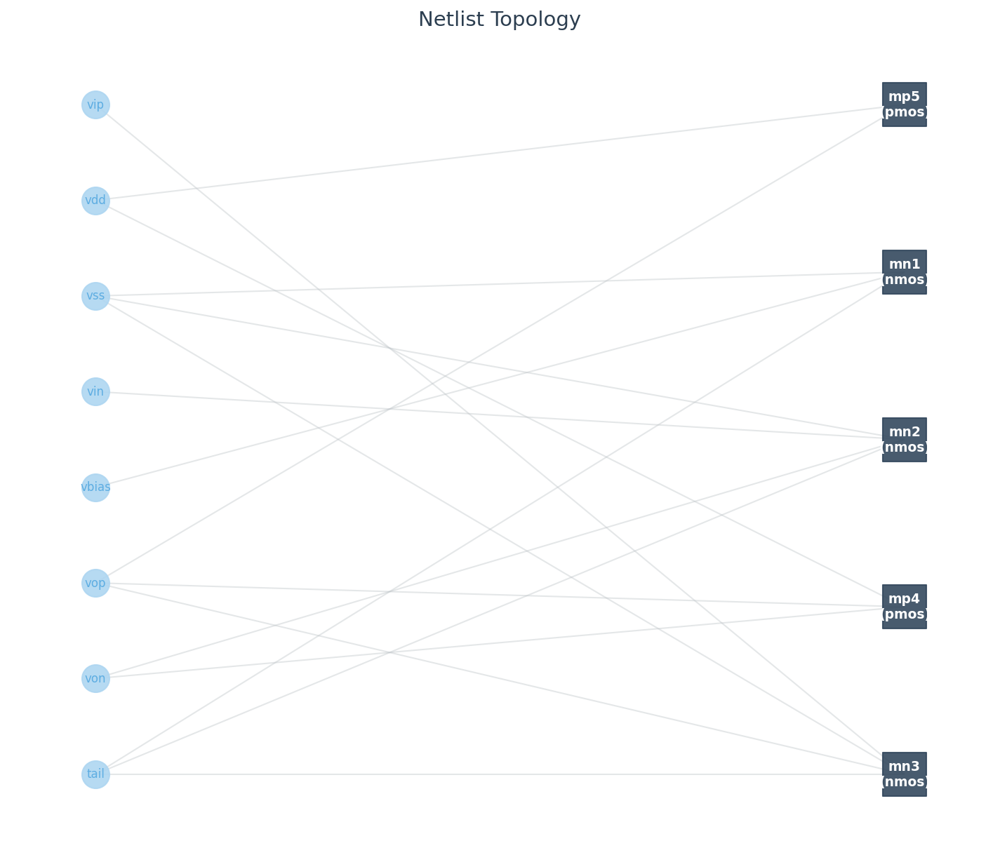
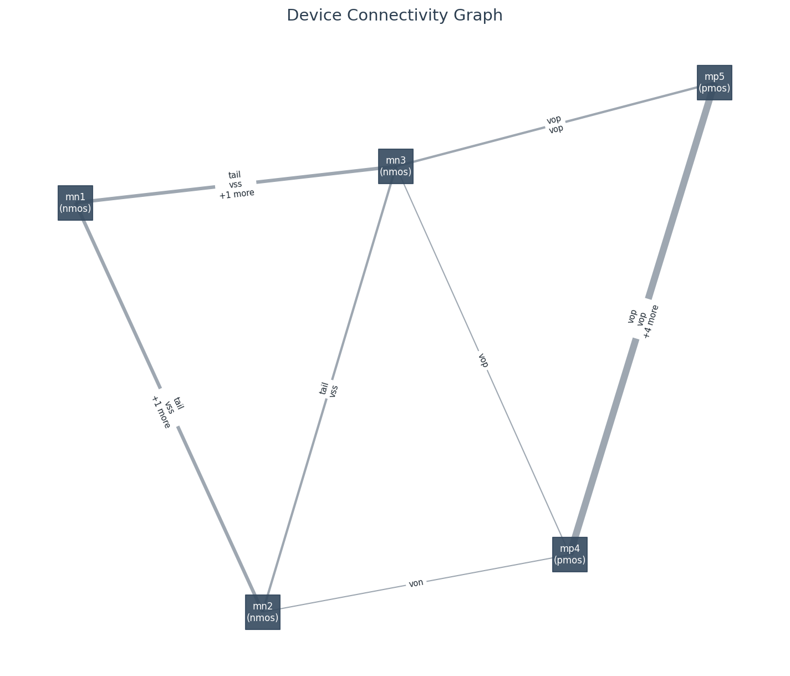

# NetlistIO

Parallel SPICE netlist parser with a bipartite graph builder and PyTorch Geometric export.

NetlistIO reads SPICE netlists, including multi-file hierarchies resolved through `.include` and `.lib` directives, and produces a linked object model. From that model you can build a bipartite net/instance graph and export it as a `HeteroData` object for graph neural network workflows.

## Motivation

This is the data pipeline layer for a GNN-based circuit topology classifier. The target corpora are SKY130 standard cells, OpenCores gate-level Verilog, and open analog datasets (AnalogGenie, AMSNet). See [docs/architecture.md](docs/architecture.md) for the full design and roadmap.

## Features

- Memory-maps input files and splits them into independently parseable byte ranges, then dispatches those ranges to a worker pool.
- Resolves the include graph iteratively: `.include`, `.lib file section`, and Cadence `[! ...]` / `[? ...]` variants. Already-visited regions are deduplicated to prevent infinite loops on circular includes.
- Links instances to definitions: tree-shaking from top-level instances, topological sort, cycle detection.
- Infers NMOS/PMOS type from model name before `.model` resolution.
- Builds a bipartite net/instance graph. Each net and each device instance is a node; each terminal connection is an edge. Terminal roles (gate, drain, source, bulk) are encoded as edge features.
- Exports to `HeteroData` via `to_pyg()`. Instance features are one-hot over model vocabulary; net features encode fanout and net type (port/signal/power/ground); edge features are one-hot over terminal name. The representation matches the bipartite multigraph used in GANA (Kunal et al., DATE 2020).
- `ScanStrategy`, `LineParser`, `ChunkParser`, and `LibraryProcessor` are abstract base classes. Adding a new format means implementing those four interfaces.

## Installation

Not yet on PyPI. Install from source:

```bash
git clone https://github.com/a18rhodes/NetlistIO
cd NetlistIO
poetry install
```

PyTorch and PyTorch Geometric require a separate install step because they are distributed from a custom wheel index that Poetry cannot target per-package:

```bash
# CUDA 12.4
poetry run pip install torch --index-url https://download.pytorch.org/whl/cu124
poetry run pip install torch_geometric

# CPU only
poetry run pip install torch --index-url https://download.pytorch.org/whl/cpu
poetry run pip install torch_geometric
```

## Example output

Five-transistor OTA from the [ALIGN benchmark suite](https://github.com/ALIGN-analoglayout/ALIGN-public).

**Bipartite graph** (net nodes left, device nodes right — the DS/GNN view):



**Device projection** (instance-only, edge width = number of shared nets — the EE view):



## Usage

### Python API

```python
from netlistio import SpiceReader

netlist = SpiceReader().read("path/to/top.sp")

for name, subckt in netlist.macros.items():
    print(f"{name}: {len(list(subckt.instances))} instances")

from netlistio.graph_analysis import CircuitGraph

cg = CircuitGraph.from_macro(netlist.macros["my_ota"])
data = cg.to_pyg()   # torch_geometric.data.HeteroData
```

### CLI

```bash
# Scanner output: byte-range regions discovered in the file
netlistio regions top.sp

# Parse, link, and summarize
netlistio parse top.sp

# Full linked tree dump
netlistio dump top.sp

# Connectivity statistics
netlistio graph top.sp --stats

# Render the graph (requires matplotlib)
netlistio graph top.sp --output topology.svg
netlistio graph top.sp --subckt my_ota --output ota.png

# Export a PyG HeteroData file
netlistio to-pyg top.sp output.pt
netlistio to-pyg top.sp output.pt --subckt my_ota
```

Use `-v` / `-vv` for verbose logging, `-q` to suppress warnings.

## Status

Core parser, linker, and graph builder are complete with 100% test coverage. Structural validation against ALIGN benchmark circuits (Kunal et al., DATE 2020) confirms the bipartite graph representation. Structural Verilog parser and GNN training pipeline are planned. See [docs/architecture.md](docs/architecture.md).

## License

Apache 2.0. See [LICENSE](LICENSE) and [NOTICE](NOTICE).
